---  
title: Blender 模型怎么导入 Unreal  
date: 2023-06-27T16:24:00:00  
lastmod: 2023-12-22T17:59:00  
tags:  
  - Unreal  
  - TIL  
  - Blender  
aliases:   
publish: true  
categories:  
  - 软件  
---  
（从 SketchFab 下载下来的也可以参考这个，大概）  
  
## 前言  
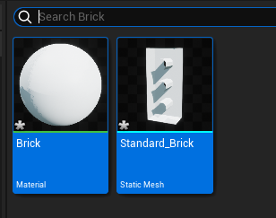  
导入进去之后材质会丢掉，怎么会是呢？  
  
参考这个教程：  
  
> [油管地址](https://www.youtube.com/watch?v=N8y_eH7QB2o)  
  
先选 Export 然后选择 `.fbx` 格式；  
  
## Blender 里的纹理  
SketchFab 下载过来的模型是分开的，导入 Blender 会显示白模。  
怎么把纹理贴图重新加回去呢？  
  
要用到插件 `Node Wrangler` ；  
  
首先导入模型，然后打开 Shading 界面：  
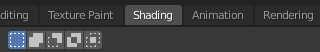  
  
选中物体，右边的属性界面切到材质：  
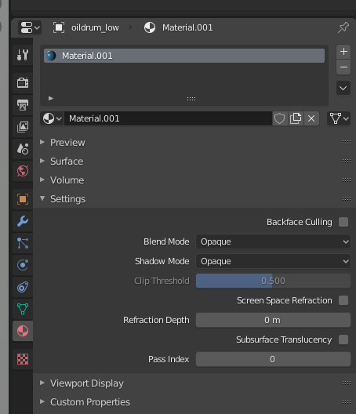  
  
如果没有的话就先按加号新建一个；  
  
然后在着色器窗口能看到两个节点，  
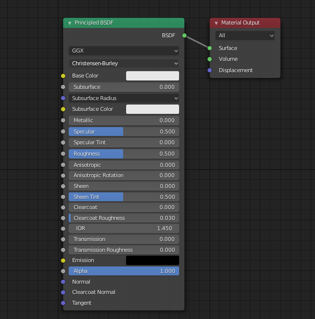  
  
选中 Principled BSDF，然后按快捷键 `Ctrl+Shfit+T`；  
在打开的窗口中全选材质图片：  
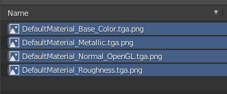  
  
插件就会自动创建好各个节点：  
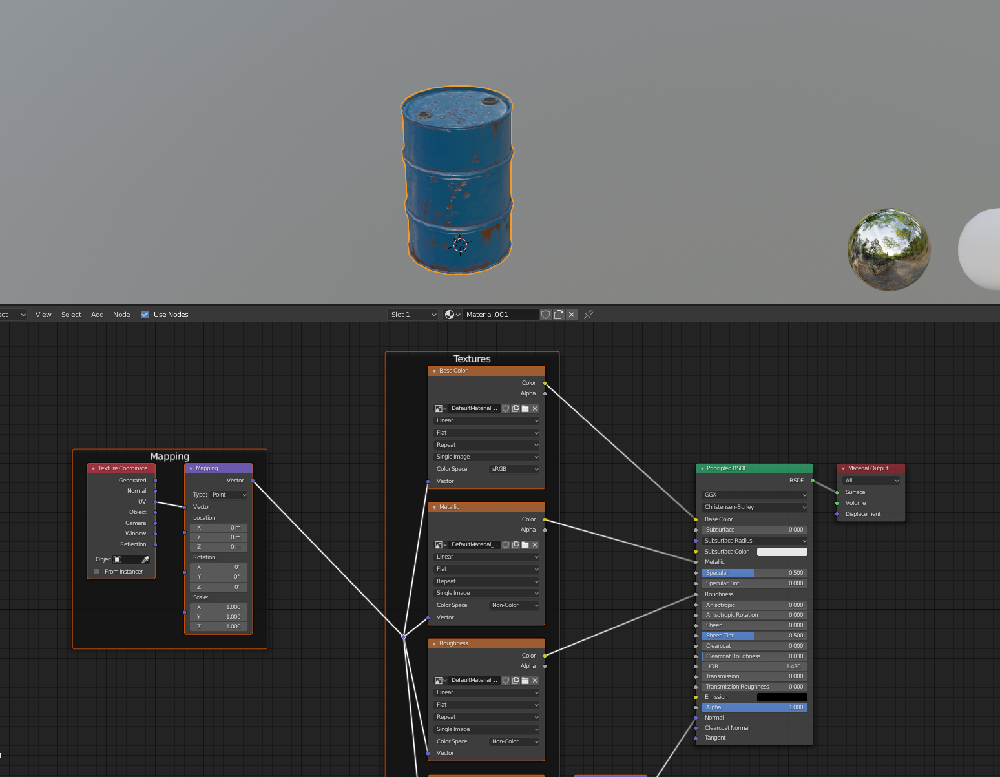  
  
  
## 打包纹理  
导出->fbx 格式：  
  
`Path Mode` 选成 **Copy**：  
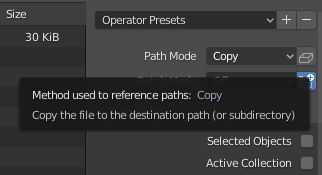  
然后勾选边上的 `Embed Textures` 按钮：  
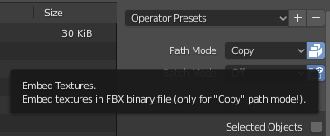  
  
这样才能把纹理一起打包进去。  
  
## 限定范围  
东西多的话可以只勾选 `Selected Objects`，然后下面也可以只选 `Mesh`：  
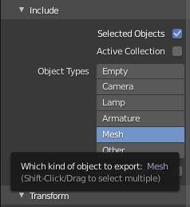  
  
这样可以避免把相机和灯光啥的一起导出。  
> ——底下这个 Mesh 可能得小心，好像会导致啥都没导出来。  
  
导出之后可以预览  
  
## 轴向  
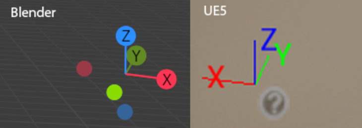  
[newbie: Blender to UE4 settings and how to get objects oriented on the right axis : unrealengine](https://www.reddit.com/r/unrealengine/comments/kw2v88/newbie_blender_to_ue4_settings_and_how_to_get/)  
  
详见下方  [坐标轴歪了？](#坐标轴歪了？) 章节。  
  
## 平滑？  
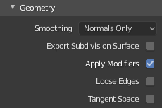  
视频里说这里也可以把 `Smoothing` 改成 `Face`，但我不太明白，先不动。  
  
  
## 保存导出预设  
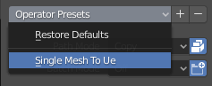  
完事儿可以存成一个 Preset 方便复用。  
  
## 坐标轴歪了？  
[Blender模型导出到ue4_blender骨骼导入ue方向问题_三尺三的博客-CSDN博客](https://blog.csdn.net/jxyyl/article/details/120328702)  
  
blender：  
将模型面朝X轴放置，清除旋转与缩放。  
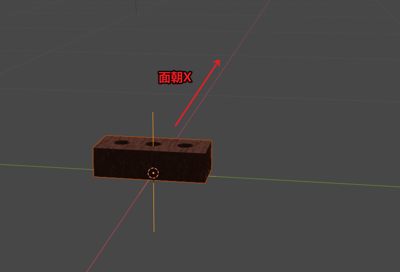  
  
<mark>⭐️重要：单位改成 0.01：</mark>  
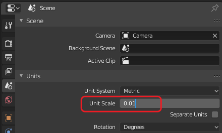  
可能因为 UE 里是 0.01 米等于一个单位？  
  
导出的时候：  
* Forward 选择 `-Y Forward`  
* Up 选择 `Z Up`  
  
  
  
  
  
原理（个人理解）：  
1 blender中将模型朝向要导入软件的正方向  
2 blender中导出时，将正方向设置为blender的正方向（-Y）  
以上两点可以在软件的背视图中查看。  
  
  
按他说的…… `-Y`是 Blender 的朝前，然后 UE 里则是 `X` 朝前？  
试试看！  
  
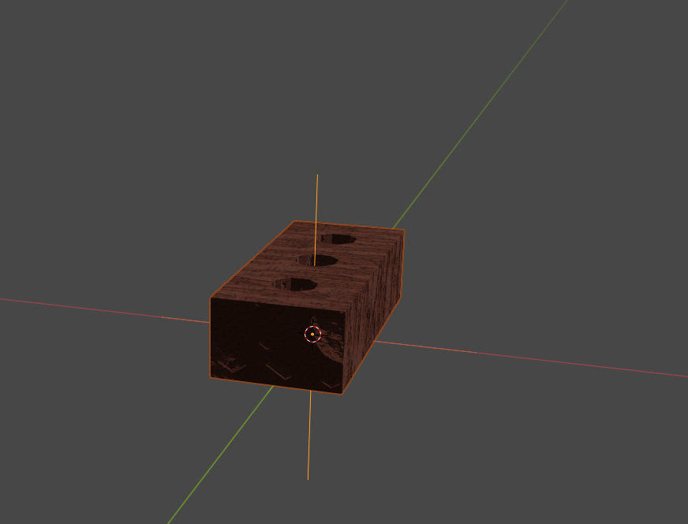  
Blender 里的样子；  
  
导入之后：  
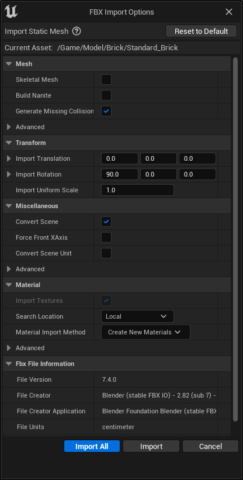  
  
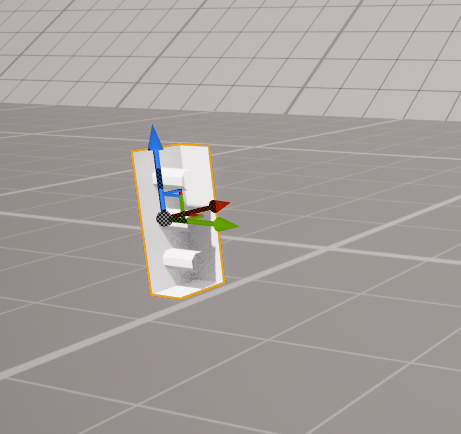  
……歪来。  
且不说纹理还是丢失的；是不是因为那个 `Rotation X=90` 啊？  
  
# 问题排查  
  
## 纹理的问题  
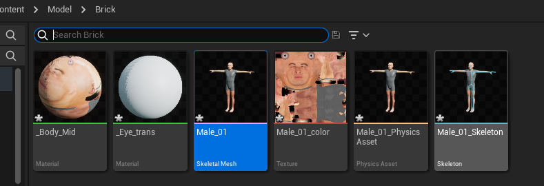  
抓了另一个 fbx 导入，纹理都是正常的；  
包括 Windows 的 3D 查看器也能正常显示。  
  
所以还是 Blender 里没能导出成功……  
  
## 还是看看远方的 Node Wrangler 吧  
记住快捷键：`Ctrl+Shift+T`  
  
启用 Node Wrangler Add-on 的情况下，打开 Shader 编辑器，选中 `Principled BSDF` 后按下快捷键：  
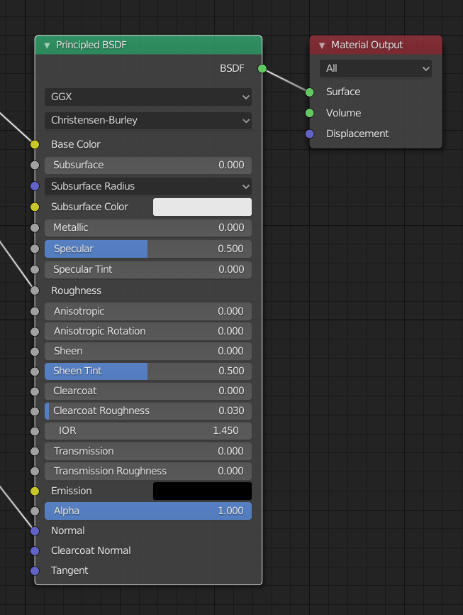  
  
  
  
  
「原理化（基于物理的）散射分布函数」  
BSDF = Bidirectional Scattering Distribution Function，双向散射分布函数  
  
  
  
  
然后选中所有的贴图，就会自动创建好节点。  
  
这样导出的模型是带贴图的，试过了。  
  
……Fuck.  
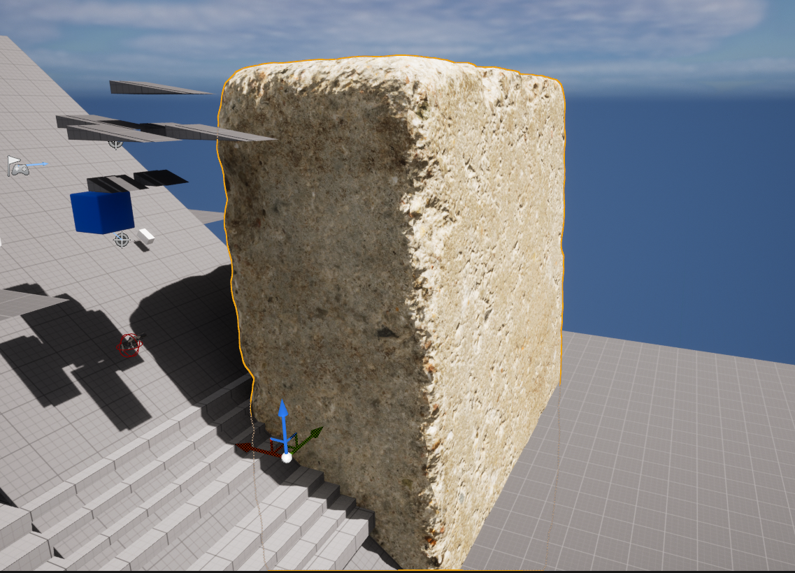  
  
