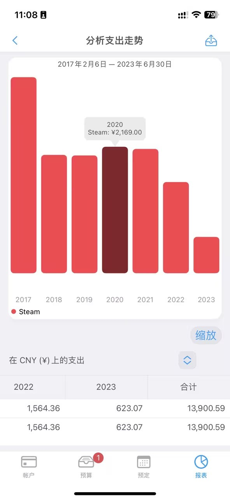
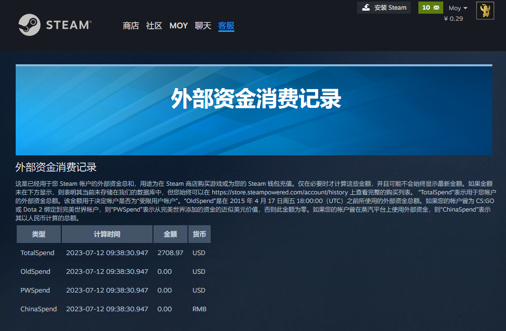
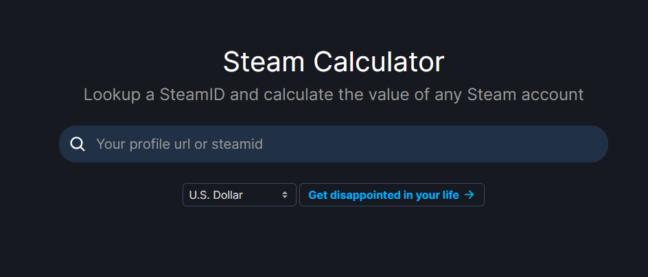
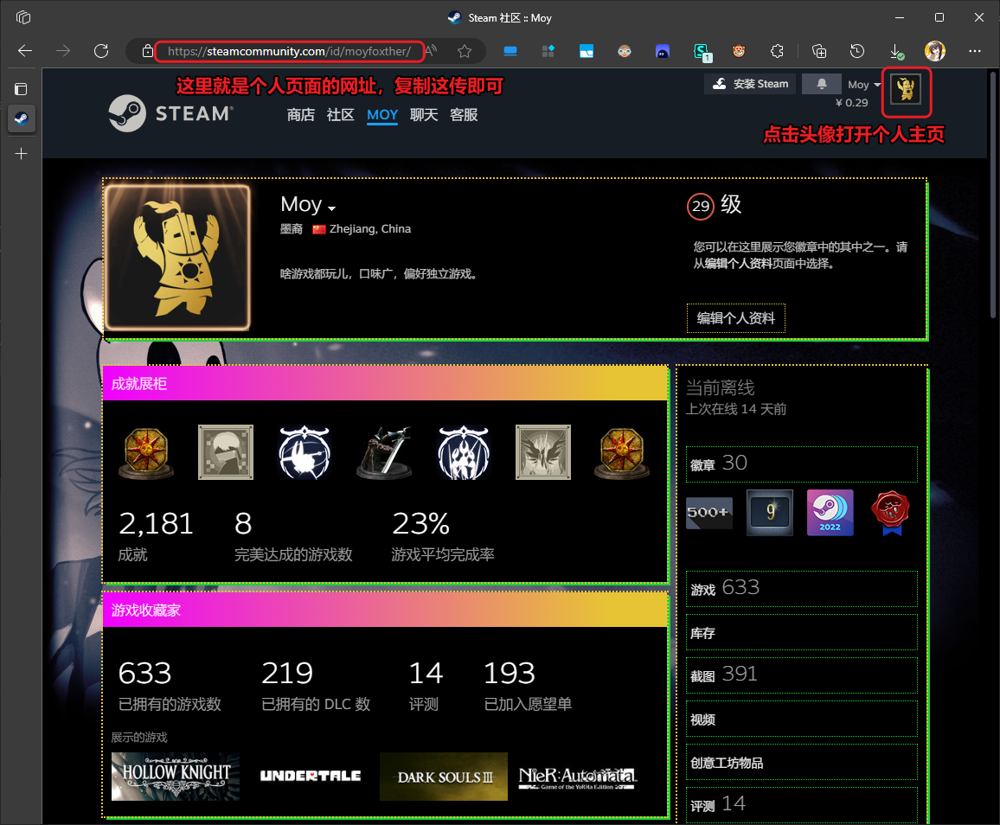
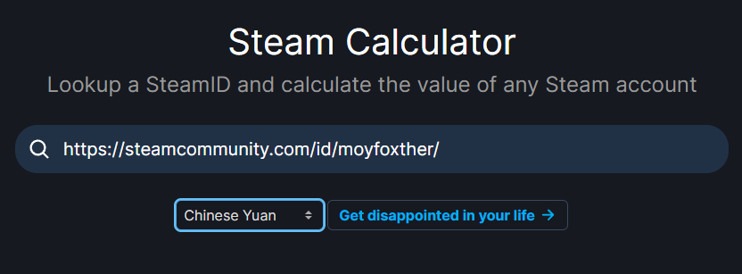
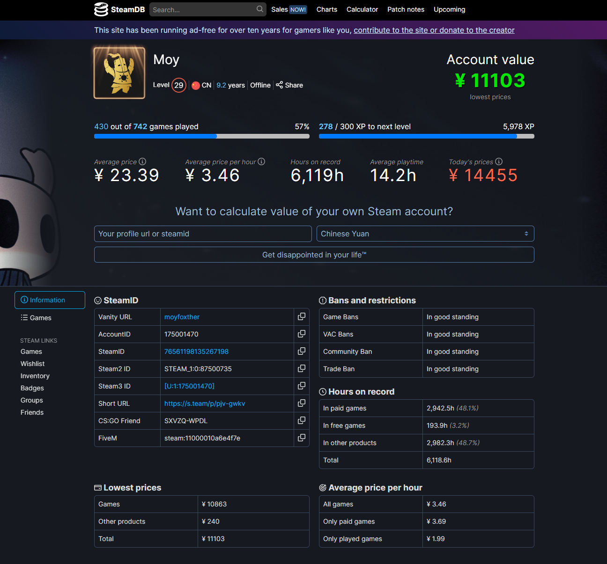
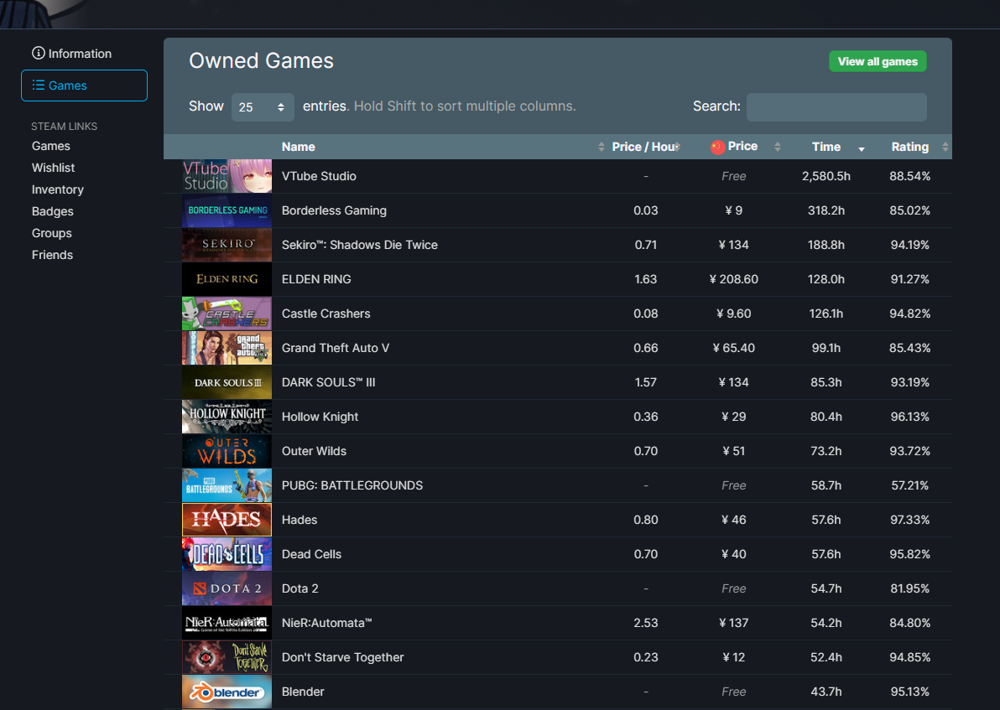

---  
title: 测测你的 Steam 账号价值吧！  
description: 偶然和朋友间聊起“steam游戏库值多少钱”，于是找办法测了一下……  
date: 2023-07-13T11:53:00  
lastmod: 2023-07-13T14:58:00  
tags:   
aliases:   
publish: true  
image: Assets/Pasted-image-20230713115838.png  
categories:  
  - 游戏  
  - 分享  
---  
  
# 测测 Steam 账号价值！  
  
## 起因  
  
其实是和朋友聊天聊到这个。  
  
```dialogue  
left: 朋友  
right: Moy  
< 话说  
< 你Steam库存里的游戏总价要多少  
< 我觉得会是笔巨款  
> 谁、谁会去在意这种事情呢，哈哈……哈哈哈  
```  
  
虽然很心虚不过还是查了查自己的记账，从 2017 年起到现在大概是1W4：  
  
  
可以看到还是比较稳定的……除了第一年买的比较多，之后每年2k左右？  
~~大概也就是手游3单648嘛~~  
最近几年因为 Steam 上大部分感兴趣的游戏都已经入库了，只买些新游戏为主，所以开销显著下降。  
  
但不是谁都有~~我这样强迫症的~~记账习惯，所以又顺便上网搜了一下，看到有两个网站可以查询自己 Steam 的账号价值。  
  
## Steam 官方消费记录查询  
  
打开这个网站：  
[帐户数据](https://help.steampowered.com/zh-cn/accountdata/AccountSpend)  
（认准域名是 `steampowered.com` 噢，谨防诈骗网站）  
  
登录 Steam 账号的情况下就能查到自己历来的消费记录了：  
  
  
可以看到是 2708.97 美元，换算过来……将近2W人民币。  
比我自己记录的多了不少，可能是因为买游戏作为礼物送朋友的也算上了。  
  
## 账号游戏估值查询：Steam 计算器  
  
[Steam Calculator and SteamID Finder · SteamDB](https://steamdb.info/calculator/)  
  
这个网站是大名鼎鼎的 SteamDB，同样提供了查询 Steam 账号价值的功能。  
但是它毕竟不是 Valve 官方，所以只能从你的游戏库来推测这些游戏价值几何。  
  
登录之后输入自己的 Steam ID 就可以查询：  
  
  
Steam ID 可以通过点击自己的个人账户页面查看，比如：  
  
  
把网址复制下来粘贴进去就可以。  
  
下面的选框可以切换货币单位，人民币就换成 `Chinese Yuan`：  
  
  
然后就可以点击 **Get Disappointed in your life（对你的人生感到失望吧）** 按钮来进行查询了！  
  
这个网站不仅会列出估值，还会综合游戏时间之类的因素，来得出各种数据……  
  
  
像是：  
  
* xx out of xxx games played（第一个进度条）：买了的游戏里玩过多少个  
* Average price：平均每个游戏价值多少  
* Average price per houer：平均每小时游戏时间花了多少钱  
* Hours on record：记录的总游戏时长  
* Average playtime：平均每款游戏玩了多久  
* Today's prices：在今天购买所有产品需要花费的金额  
  
因为最近在夏促所以显然我的账号*贬值*了不少……哈哈……  
底下还有更多详细的数据，这里就不赘述了。  
  
### 游戏列表  
  
点击左侧的 `Games` 按钮的话，能看到具体的游戏清单：  
  
  
合着我总共6000多个小时的游戏时间里有2580小时是在直播啊……哈……  
那我玩游戏的时间也太少了！  
  
```dialogue  
l: 脑内的评论小人  
r: Moy  
  
< 你直播这么久一定舰长很多吧？  
> 啊……哈，哈哈……直播嘛，重要的是开心咯  
> （我自己都没想到我播了这么久的时长？！）  
  
```  
  
## 一点感想  
  
其实真要看的话……我 Steam 账号注册了9年多，实际在玩儿游戏算八年，平均下来在 Steam 上的游戏花销确实就是2k+/年。  
  
学生党可能会觉得有点多，但阿墨是很多年的社畜啦。  
以「娱乐活动」来说……一年两千吗，嗯，真的是偏廉价的娱乐了。  
  
出去旅游可能机票都要两千起，买点儿电子产品也是随随便便就几千没了。更别说一些比较烧钱的爱好比如摄影（？）和手游。  
可能相比之下……看电影会是差不多的「廉价娱乐」？算一张票60的话，2500可以看40部电影，平均每个月看3.3部……也很爽了嘿。  
  
总之，能用相对低廉的价格体验到多次多彩的旅程和故事，我真是太爱电子游戏了。  
谢谢开发者们。  
  
好，这就是今天的分享！希望对你有帮助！  
让我们一起对自己的人生感到失望吧！（bushi）  
