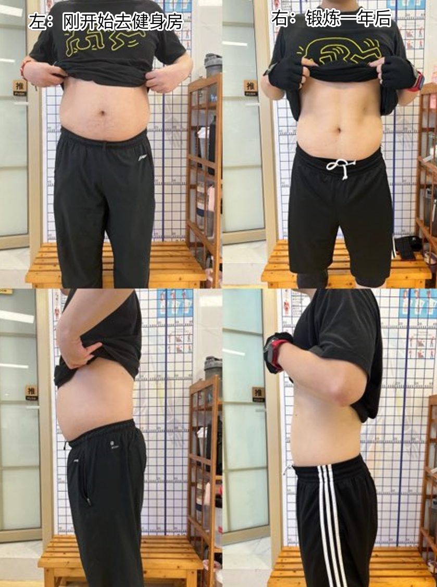
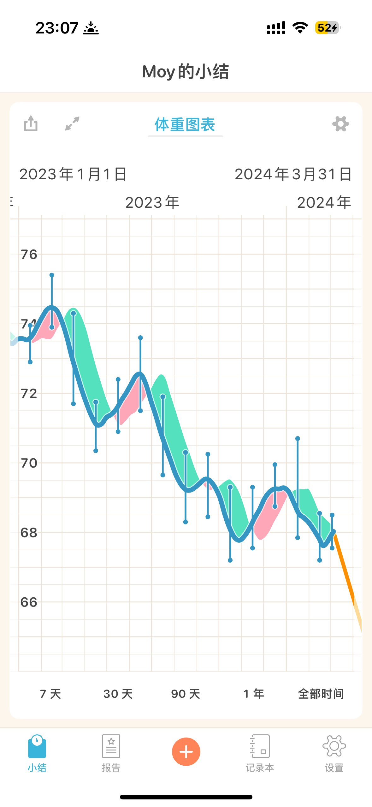
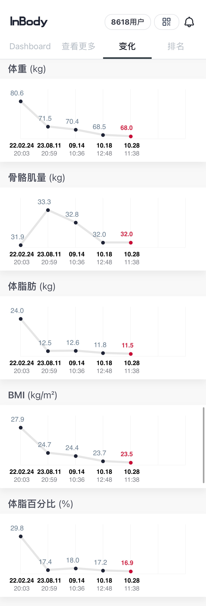

---  
title: 自己的减肥经验总结  
date: 2023-09-21T11:09:00  
lastmod: 2024-03-06T00:55:00  
tags:  
  - 健身  
  - 减肥  
aliases:   
description:   
categories:  
  - 分享  
  - 生活  
publish: true  
math: true  
---  
  
# 自己的减肥经验总结  
  
## 起因  
  
开始新一阶段的减肥计划了。  
  
目前的成果：88kg 到 69kg，从「肥胖」步入「标准」（略健壮）；  
新的（最难的）目标：62kg。  
  
  
  
  
> 其实用体重衡量是一个非常不合理的行为，应该从体脂率等等更全面的维度入手。但我是个人的执念了，哈哈。真正的目标应该是「很好的身材 AKA. 六块腹肌」。  
  
  
## 停滞的原因分析  
  
每个周末的空腹有氧和**体能训练**（无氧）没了，非但如此还会在周末吃很多；  
  
> 不过「空腹」的有效性其实待考证，甚至一般来说是不建议空腹的因为会低血糖。  
  
而且确实锻炼的频率也明显低了。  
  
> *训记App* 里能看到的。  
  
虽然说一些资料（斌卡的书）里提到，在进行大量锻炼之后多吃一些是没啥问题的，不会变胖，反而长肌肉。  
但——其实，多吃的那部分卡路里是很轻易就能超过多运动消耗的。  
  
所以如果是减脂，无论如何都要控制摄入，仗着“今天锻炼了可以多吃一点”的话，**热量缺口**不会骗你，能量守恒定律也不会。  
以及哪怕每周或者每两周一次的「欺骗餐」，这个视频里说也应该是**不超过一天的基本摄入量（零缺口）**而不是就直接暴吃  
  
## 新的尝试：TABATA  
  
TABATA：HIIT 的一种，属于比较猛的。  
原教旨主义认为心率一定要满足一定要求，那种慢吞吞的单纯用了 $(20s+10s)\times8$ 的方法是伪 TABATA。  
（也会有效，但是另一回事儿了）  
  
### 4分钟够吗？  
  
其实原版来说……太够了，一周也就训练4~6次。  
  
但是对减脂来说总感觉「不太到位」？  
或者说，按之前健身房做**体能训练**的经验，那也是拆分成几组，然后做满40分钟这样。  
  
那可以把一次4分钟的 TABATA 作为「一组」，然后中间休息1~2分钟，总共做4组。  
这样一来就是比较到位的一次完整锻炼了。  
  
坚持不了这么久那就再说，哈哈。  
  
  
  
  
虽说如此，一定要注意强度和安全!  
  
  
## 2023.11.03 更新  
  
现在是67kg多点，其实进度也还是缓慢。  
TABATA 之前简单尝试了一下……但是没有坚持很久。  
感觉还是，对身体负担比较大，**容易受伤**。  
  
那现在来看，主要还是：空腹有氧少了。  
  
最近比较好的两个改进是：  
1. 看了 ████ （好人松松的视频[^1]）之后，成功自己做了每天的摄入记录，对于自己的摄入情况有了一个明确的、数据化的结果（真的做起来也没那么难！）  
2. 计算了 ████，和上面那条相呼应，了解了自己应该的摄入比例  
3. 算是重新稳定下来自己去健身房一周三次的力量训练。力训还是不能落下。  
  
然后也测了几次 Inbody，好消息是肌肉确实没再那么掉了……目前是堪堪维持在 32 kg，不如当年的 33 的水平。  
但在肌肉量不变的情况下，脂肪和体重在下降。挺好的。  
  
那么接下来的话，自己练也应该尝试去加大一点点重量了，不然的话，就，没有受到足够的「应激」肌肉也没理由继续增长。  
  
  
  
  
  
  
  
### 接下来呢？  
  
打算是：  
1. 早上的空腹有氧还是恢复起来，放进 OKR 里每周跳4天吧（躺在床上玩手机就纯纯浪费）  
2. 还是试一下 16+8 的轻断食，反正对我来说也就是午饭 11 点再吃吐司，并不算什么很费事儿的调整；晚饭也是6点半吃的，没啥问题。  
3. 每周三次的力训也保持下去，可以在安全范围内尝试加一点重量上去了  
  
然后11月的目标定高一点，现在是 67.5kg 的样子，月底希望能直接冲到 65 kg！  
  
## 2024.03.05 更新  
啊……结果最近 3 个月下来，体重和数据还是基本没变！  
看来还是差一个「认真减肥」的状态。  
  
  
  
[^1]: 来自B站 Up 主「好人松松」的视频：[【生活化减脂减肥】从理论到案例 就吃食堂外卖✅](https://www.bilibili.com/video/BV1794y1a7y4)  
  
