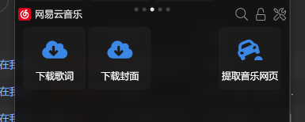
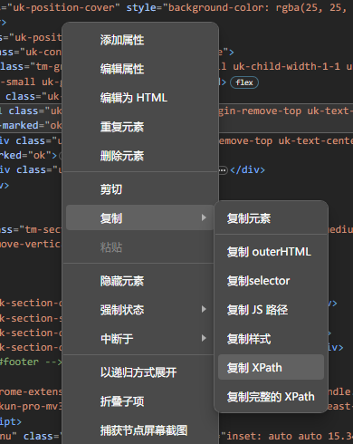

---  
title: 网易云的音乐封面歌词获取（更新）  
date: 2023-10-17T16:09:00:00  
lastmod: 2023-10-17T16:18:00  
tags:  
  - quicker  
  - 工具流  
  - TIL  
aliases:   
description:   
categories:  
  - 工具  
publish: true  
---  
  
# 网易云的音乐封面歌词获取（更新）  
  
## 起因  
  
之前的两个动作不生效了，重新想办法。  
  
  
## 封面  
  
改成直接读取 <meta> 元素了：  
  
用音乐的原链接打开 HTML，然后提取 XPATH：  
`/html/head/meta[@property="og:image"]`  
  
顺便，在浏览器其实可以 F12 然后右键，复制 XPATH：  
  
  
## 歌词  
  
暂时没找到怎么办……  
直接用了一个第三方的 API 服务：  
[网易云音乐 NodeJS 版 API](https://neteasecloudmusicapi.vercel.app/#/)  
  
虽然 NodeJs 啥的好像很麻烦，但是这个部署好了的 Vercel 站点是直接可以用的；  
比如查歌词就是：  
`api.music.areschang.top/lyric?id=1501530173`  
  
更多内容见文档：  
[网易云音乐 NodeJS 版 API 文档](https://neteasecloudmusicapi.vercel.app/#/?id=neteasecloudmusicapi)  
  
回头可以再研究一下，反正是开源的。  
Github 库也 Fork 过来了。  
  
## EasySpider  
  
这个简单试了一下，有点麻烦，没搞明白……下次再说！  
[易采集EasySpider下载地址](https://www.easyspider.net/download.html)  
