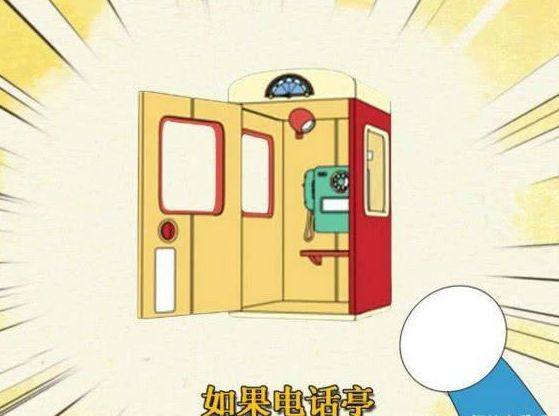

---  
title: 让自己去做一件事的两个小技巧  
description:   
date: 2023-11-03T15:55:00  
lastmod: 2024-02-26T23:26:00  
aliases:   
tags:  
  - 感悟  
categories:  
  - 生活  
  - 技巧  
publish: true  
---  
  
# 让自己去做一件事的两个小技巧  
  
1. 提前想象自己在做这件事的画面  
2. 如果有任务清单的话，**先打勾**，倒逼自己做完这事儿，达成因果一致！  
（什么如果电话亭，笑）  
  
  
