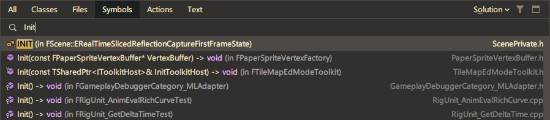
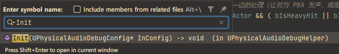
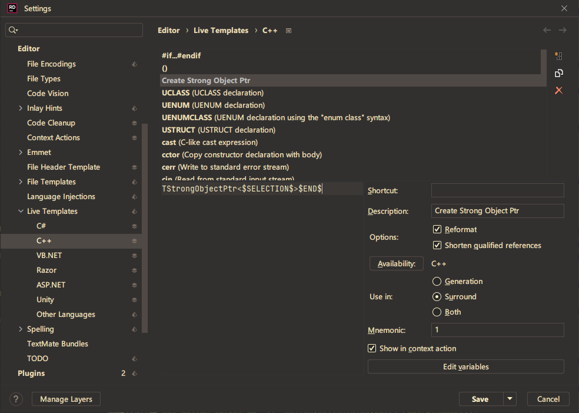
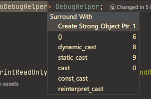
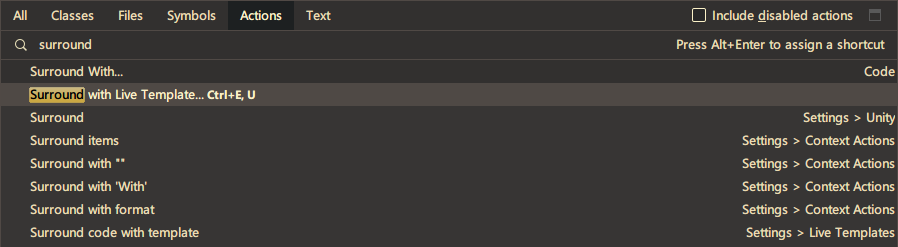
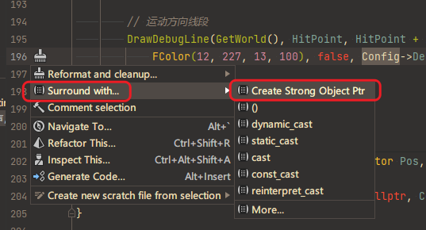

---  
title: Rider 的两则小知识  
date: 2023-12-18T16:15:00:00  
lastmod: 2023-12-20T18:28:00  
tags:  
  - 编程  
  - Rider  
  - 软件心得  
  - TIL  
aliases:   
description:   
categories:  
  - 软件  
  - 编程  
publish: true  
---  
# Rider 的两则小知识  
  
## Symbol Search 符号查询  
使用默认的搜索框，哪怕设置了 Filter，  
还是会给出一大堆的无关选项。  
  
  
  
这个时候就应该用 `Alt+\` 来查找函数啥的：  
  
  
这个是限定范围的，  
好用很多！  
  
## Fast Surround 快速包裹  
有时候会经常需要把比如 `UAkSwitchValue` 转成 `TStrongObjectPtr<UAkSwitchValue>`  
  
这时候可以用 [Live Template](https://www.jetbrains.com/help/rider/Templates__Applying_Templates__Creating_Source_Code_Using_Live_Templates.html) 功能：  
  
  
`$SELECTION$` 代表选中的文本，  
`$END$` 代表插入之后的结尾放哪儿。  
  
注意右边有个 `Mnemonic` 速记符，是在这个时候用的：  
  
唤出的方法：  
  
可以用快捷键 `Ctrl+E, U` 来快速唤出。  
___  
在右键的 Contextural Menu 可以显示，但这样太麻烦了。  
  
  
