---  
title: 使用 Snipaste 截出圆角矩形带阴影的截图  
date: 2023-12-26T17:54:00:00  
lastmod: 2024-01-02T19:57:00  
tags:  
  - 工具流  
  - TIL  
aliases:   
description:   
categories:  
  - 工具  
publish: true  
---  
# 使用 Snipaste 截出圆角矩形带阴影的截图  
  
  
## 跑题但有效：使用 ShareX 做出带圆角阴影和底色的截图  
详见：[231228_使用 ShareX 做出带各种效果的截图]()  
  
## 起因  
是在之前一个帖子里看到的效果。  
[231226_Dynamic Highlights 时间和用时数字变色](Zettelkasten/2023-12/231226_Dynamic%20Highlights%20时间和用时数字变色.md#^c3u213)  
  
一开始的研究：  
> 从 [请求自动添加阴影和窗口圆角 · Issue #1510 · Snipaste/feedback](https://github.com/Snipaste/feedback/issues/1510) 来看，还不支持。有个叫 **iShot** 的看起来能支持。  
> 等下，是支持的！  
> 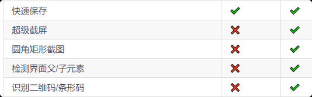  
> 截图窗口左上角能加一个选项。  
>   
> 然后 **WinSnap** 支持阴影但是不支持圆角矩形。  
  
顺便，看到这个页面：  
[用 Shortcuts 给窗口截图加边框 - #UNTAG](https://utgd.net/article/20238)  
很漂亮的个人博客！ ^b2t9zp  
（其实不是博客，应该算是一种少数派 Alter 的工具资讯站）  
  
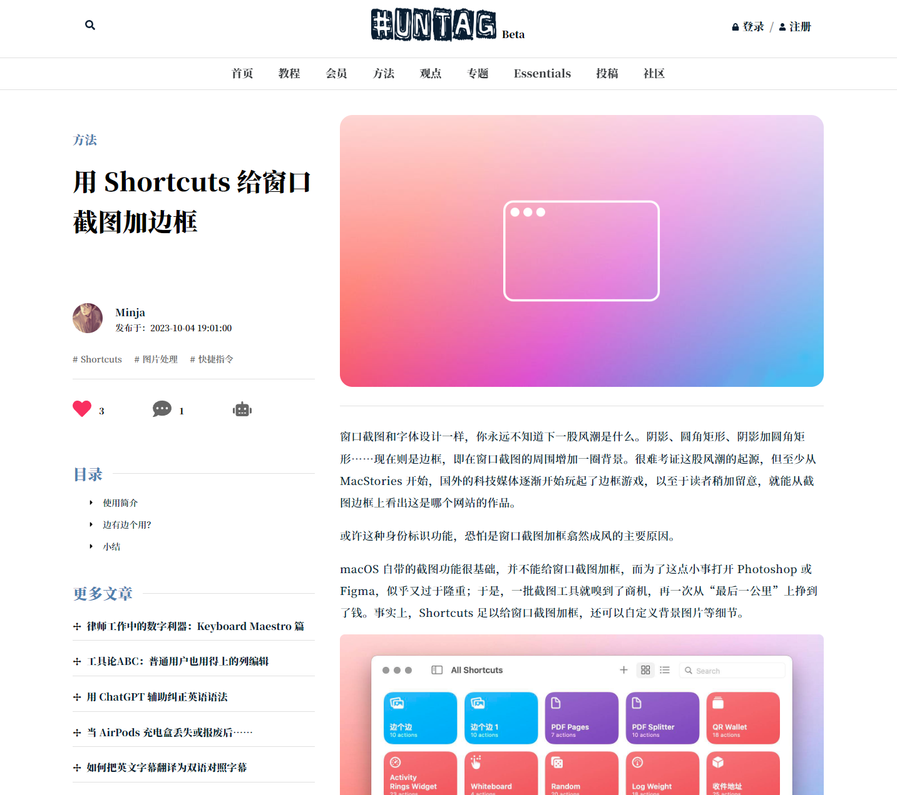  
  
重要的是这个页面不仅好看而且实用！  
提到了 Shortcuts 快捷指令的使用，以及「填充边框」这样来避免版透明色带来的体积问题。  
  
### Snipaste 里如何实现呢？  
在截图的这里，点击，更改成圆角（快捷键 `U` ）：  
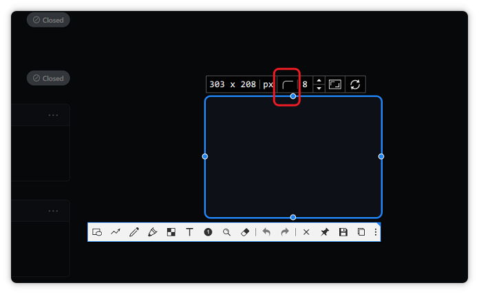  
  
然后工具栏这里，勾选阴影：  
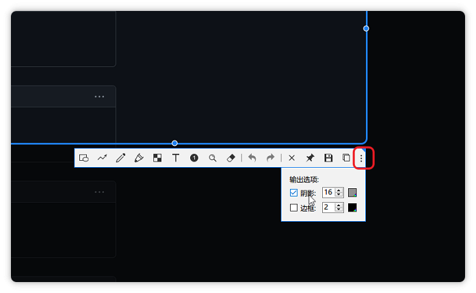  
  
  
### 注意：还有一点！  
设置里最好勾选这个「复制图像为文件」：  
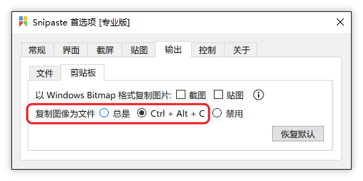  
  
不然直接作为图片格式可能会变成下面这个丑模样：  
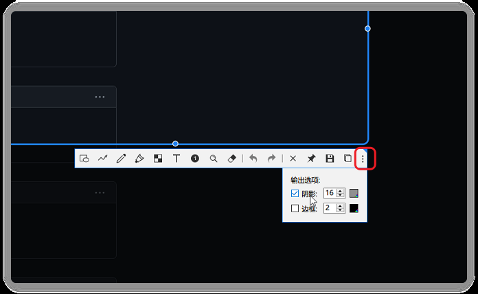  
  
*大概是因为透明通道的问题*  
  
#### 副作用：粘贴进 Obsidian 的文件命名  
由于是文件，所以粘贴进 Ob 的时候命名会是文件名：  
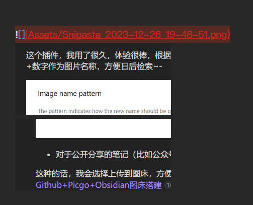  
  
——也就是说，这时候 Snipaste 的命名配置就会有用了！  
  
  
### 自动化一点呢？  
现在可以用 `U` 快速切换圆角，但是阴影选项还要手动切换，有点麻烦。  
包括**复制为文件**也要用 `Ctrl+Alt+C` 来完成。  
  
能更方便吗？  
  
[命令行选项 - Snipaste](https://docs.snipaste.com/zh-cn/command-line-options)  
  
> 结合 **`--shadow`** 获取带阴影截图；结合 **`--no-shadow`** 获取不带阴影截图。  
  
这样的话，可以用命令行截图来**强制带阴影**，第二部也搞定。  
  
如： `snip -o file-dialog;clipboard` 会在截屏选区确定后自动复制截图，并弹出文件保存对话框。  
  
那我们可以：  
`snip --shadow -o clipboard`  
  
然后在这里进行自定义：  
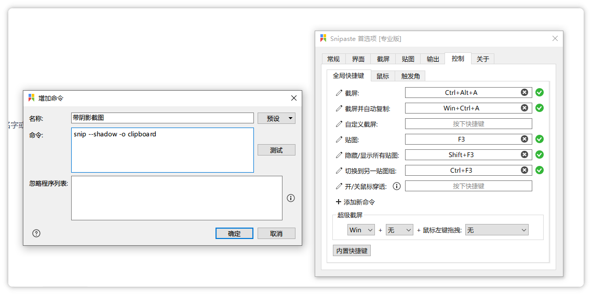  
  
效果：  
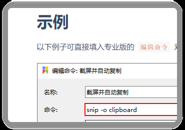  
  
Nahh 不行，阴影会加上，但不是作为文件保存的。  
是不是可以用 `-o exec` 来保存文件并复制？  
或者就干脆把 [注意：还有一点！](#注意：还有一点！) 里的设置变成默认开好叻。  
  
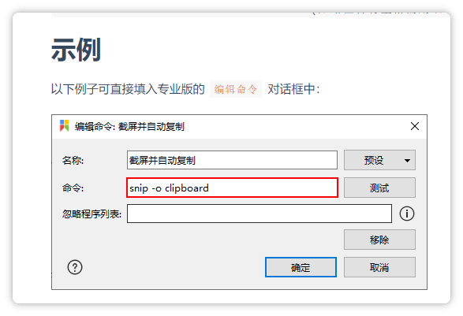  
  
OK，这样可以咯。  
  
分配了一个快捷键：  
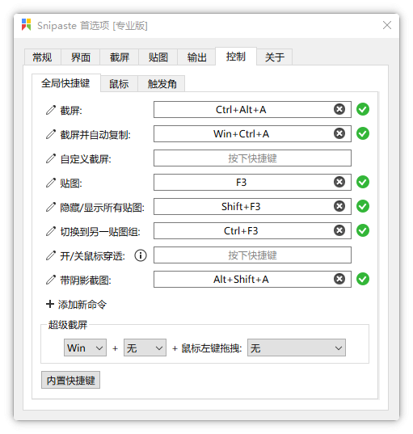  
  
这样常态是普通的截图（直角矩形无阴影），用这个特殊的「带截图阴影」则是截取美观截图（圆角矩形带阴影）。  
  
Finish！  
  
🤔 可惜直角矩形和圆角矩形的切换好像还不能在命令行和里……  
这个倒是因为有快捷键可以配合 QK 自动化；或者也可以提 FR 试试。  
  
主要是频率可能不高，就先这样吧，到此为止！  
  
（总之还是提了个 Issue： [[FR] 命令行添加参数：指定圆角矩形截图、作为文件输出 · Issue #2810 · Snipaste/feedback](https://github.com/Snipaste/feedback/issues/2810) ）  
  
  
#EOF   
  
