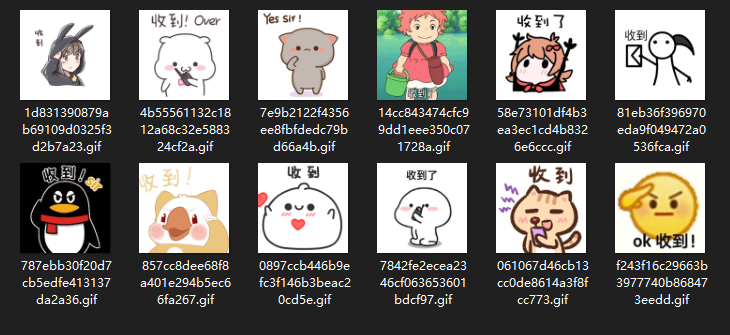
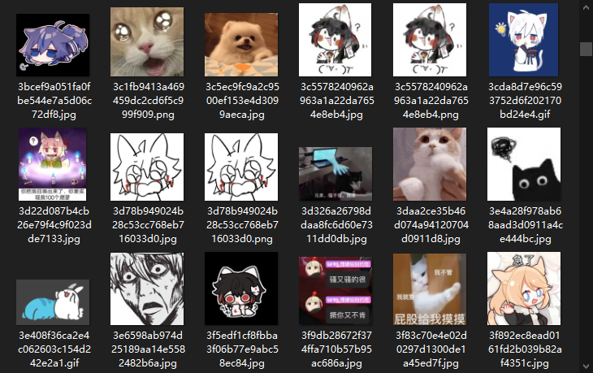
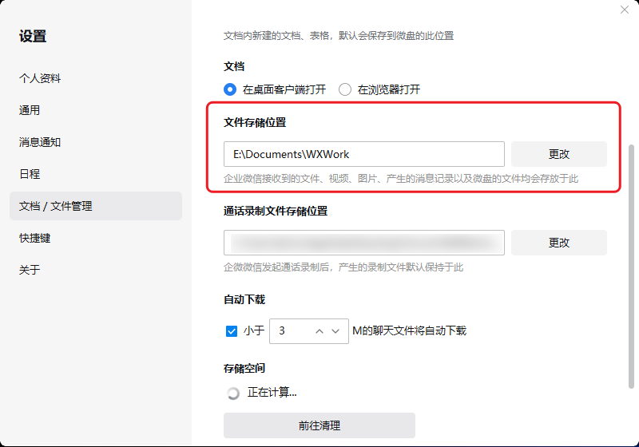
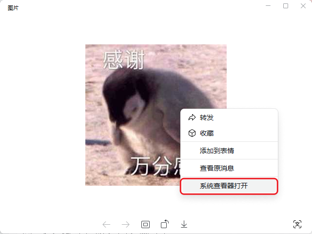

---  
title: QQ NT 版的一些文件结构探索  
date: 2023-10-08T16:19:00  
lastmod: 2024-02-27T10:37:00  
tags:  
  - TIL  
  - 表情包  
aliases:   
description: 新版 NT QQ 的表情包路径，以及一些有趣的文件夹探索。  
categories:  
  - 分享  
publish: true  
---  
  
# QQ NT 版的一些文件结构探索  
  
## 起因  
想解决自己电脑端看不到商城表情的问题。  
  
结果顺带发现了几个有点意思的路径。  
  
## 默认表情  
`..\nt_qq\global\nt_data\Emoji\emoji-resource\sysface_res\apng`  
  
有趣的是其实好几种格式这里都有——甚至还有 apng！  
  
这里还有个叫 `QLotte` 的文件，感觉是和那个动态库 `Lottie` 有关？  
  
## 关联推荐表情  
`..\[QQ号]\nt_qq\nt_data\Emoji\emoji-related\emoji\`  
  
那些打字出现的关联表情都会在这儿，可以看到好多类似含义的缓存图片。  
  
这些图片默认也是没有后缀名的，但是没有关系，可以直接用 QK 动作一键添加。  
  
可惜不知道和文本的关系存在哪里。  
> `words.json` 里存着一些文字，应该是能触发出关联推荐的关键字吧。  
  
#### 应用  
比如刚输入完文字然后闪过一个想要的表情，没能选中。  
以前我都是再反复翻好多页尝试找出来的，现在可以直接在这个文件夹按修改时间查找，一下子就找到了。  
  
  
## 自定义表情（漫游表情）  
`..\[QQ号]\nt_qq\nt_data\Emoji\personal_emoji\Ori`  
这里则是——自定义表情！  
  
以前可以导出 `eif` 的，现在新版不支持了，但是反而可以直接看到图片文件。  
所以直接备份这个文件夹就可以啦。  
  
顺便一提，会看到一些不知道怎么混进来的图片 🤔  
（可能是其他人的自定义表情？）  
  
## 表情商店  
`..\[QQ号]\nt_qq\nt_data\Emoji\marketface`  
这里能看到*出现在聊天框过的*商城表情包。  
不管是别人发的（哪怕自己并不拥有）的表情还是自己发的表情，都在里面。  
  
会按照表情包合集区分文件夹。  
  
*💡 回头批量提取出来？*   
  
### 表情商店图片  
`..\[QQ号]\nt_qq\nt_data\Emoji\emoji-recv`  
  
这里就是接收的表情包啦（应该也包括自己发出去的）。  
会按照月份分开文件夹保存。  
  
*❗ 感觉适合用来作为 Quicker 表情包检索动作的素材来源！*  
*不过大概需要先去重……*  
  
## 聊天图片  
`..\[QQ号]\nt_qq\nt_data\Pic\2023-10\Ori`  
和上面的**表情包 Emote**区分开来的其他图片。  
（也不知道是靠什么区分的……）  
  
#### 其他媒体文件  
还有 `Video` 啥的，同理，这里不再赘述……  
  
不过有个 `ptt` 不知道是啥，里面是 `amr` 格式的文件。  
  
## 企业微信的表情包  
顺便，之前发现的：  
`E:\Documents\WXWork\1688853793444655\Emotion\2019-12`  
  
  
可以通过双击图片快速打开：  
  
