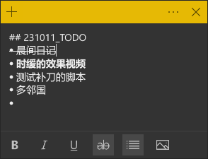

---  
title: 子弹笔记的一些简单尝试  
date: 2023-10-08T16:16:00  
lastmod: 2024-02-26T23:36:00  
tags:  
  - TIL  
aliases:   
description:   
categories:  
  - 经验  
publish: true  
---  
  
# 子弹笔记的一些简单尝试  
  
## 起因  
在用「事线」作记录，  
然后想到有没有什么「基于纯文本」的格式化方法。  
  
首先当然是 Markdown 了，但是……  
如果是列表呢？  
「子弹笔记」  
  
## 柴老师讲解  
以下是子弹笔记的要点以及几种常见的符号：  
  
要点：  
1. 子弹笔记是一种组织和记录信息的方法，旨在提高学习和记忆效率。  
2. 它采用简洁明了的结构，将信息分为主题、子主题和细节，并使用符号进行标记和分类。  
3. 子弹笔记的核心原则是快速记录和简化信息，以便后续回顾和复习。  
  
符号：  
1. •（圆点）：用于表示主要主题或标题。  
2. -（短横线）：用于表示子主题或次要标题。  
3. ▸（箭头）：用于表示细节或子细节。  
4. ○（空心圆）：用于标记待办事项或任务。  
5. ×（叉号）：用于表示**已完成**的任务。  
6. !（感叹号）：用于强调重要信息或提醒。  
7. \*（星号）：用于标记特别重要的信息或注释。  
  
这些是子弹笔记的基本要点和常见符号，你可以根据自己的需求和喜好进行适当的调整和扩展。希望对你有所帮助！  
  
  
## 对我而言  
```txt  
* 这个是默认的符号  
## 这个是标题（对，没必要都一个层级）  
> 细节？  
! 重要  
```  
  
…… 那感觉可以这样：  
  
  
  
  
## 主题  
* 一条  
* 两条  
* 取消的事儿 （手写就划掉）  
* 完成的事儿 ✅  
* 重要的事儿 ❗   
	* 子内容就用缩进来做  
	* 手写也方便  
  
  
——结合 MD 语法的“M式子弹笔记”，挺好？  
  
## 231011_后续：便笺上的应用  
> 嗨呀，忘了是写在这儿还是写在「事线」上的了……  
> *笔记应用多起来以后就是会有**这种麻烦** *！  
  
刚才试了一下，发现其实这种简化的子弹写法对于 Windows 自带便笺也是适用的：  
  
  
只不过因为不支持层级，所以可能还是要用那个 `-` 等于子级的写法。  
然后「强调」就用加粗；  
完成或者取消都可以用「划掉」。  
  
这样就可以啦！  
  
  
  
  
