---  
title: 使用 ShareX 做出带各种效果的截图  
date: 2023-12-28T17:57:00:00  
lastmod: 2024-01-14T00:17:00  
tags:  
  - TIL  
  - 工具流  
aliases:   
description:   
categories:  
  - 工具  
publish: true  
---  
  
# 使用 ShareX 做出带各种效果的截图  
  
  
  
  
[2023.12.26 使用 Snipaste 截出圆角矩形带阴影的截图]()  
  
  
根据下面 [Untag](个人博客/TIL/2023.12.26%20使用%20Snipaste%20截出圆角矩形带阴影的截图.md#^b2t9zp) 的页面，感觉带底色的截图也挺好看的！  
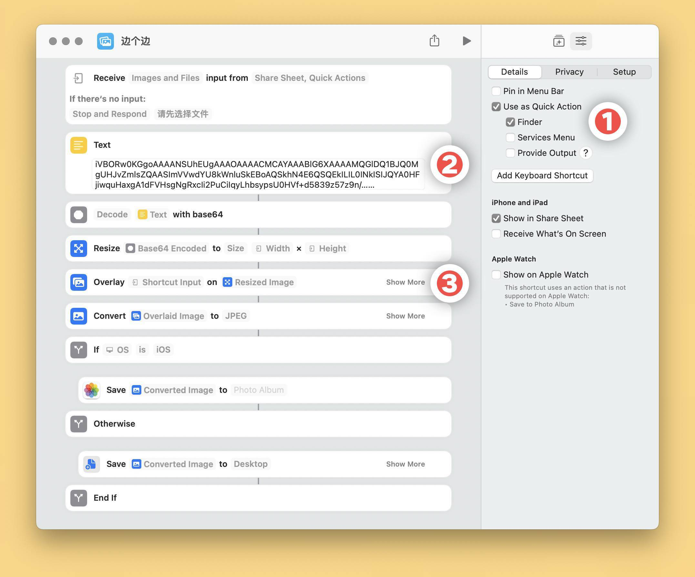  
尝试实现一下看看。  
  
ShareX 有一个功能是截图后自动增加特效/水印：  
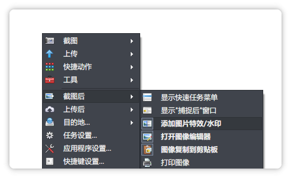  
  
在任务设置里可以进行配置：  
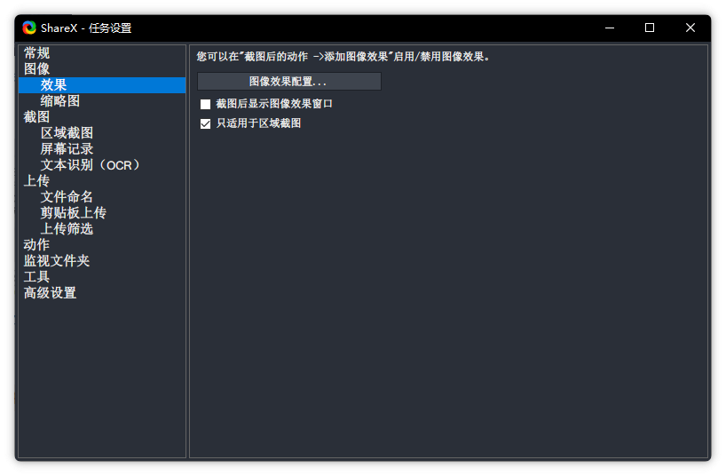  
  
对于**添加背景**，可以用这几个步骤：  
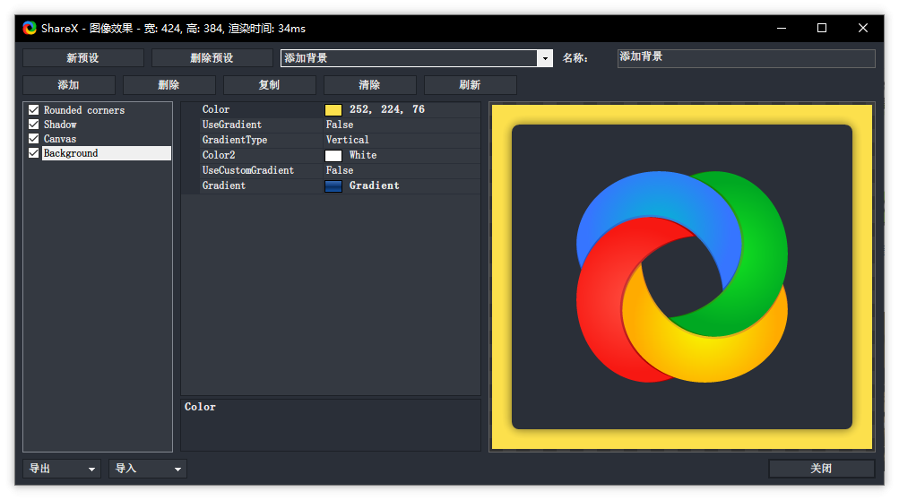  
* Rounded Corners：8  
* Shadow：  
	* Opacity 0.6  
	* Size 12  
* Canvas：10 （用来向外拓展画布）  
* Background：填充底色  
  
配置代码如下，可以用左下角按钮直接导入。*（新版不支持剪贴板导入了）*  
  
  
  
```json  
{  
  "Name": "添加背景",  
  "Effects": [  
    {  
      "$type": "ShareX.ImageEffectsLib.RoundedCorners, ShareX.ImageEffectsLib",  
      "CornerRadius": 8,  
      "Enabled": true  
    },  
    {  
      "$type": "ShareX.ImageEffectsLib.Shadow, ShareX.ImageEffectsLib",  
      "Opacity": 0.6,  
      "Size": 12,  
      "Darkness": 0.0,  
      "Color": "Black",  
      "Offset": "0, 0",  
      "Enabled": true  
    },  
    {  
      "$type": "ShareX.ImageEffectsLib.Canvas, ShareX.ImageEffectsLib",  
      "Margin": "10, 10, 10, 10",  
      "Color": "Transparent",  
      "Enabled": true  
    },  
    {  
      "$type": "ShareX.ImageEffectsLib.DrawBackground, ShareX.ImageEffectsLib",  
      "Color": "252, 224, 76",  
      "UseGradient": false,  
      "GradientType": "Vertical",  
      "Color2": "White",  
      "UseCustomGradient": false,  
      "Gradient": {  
        "Type": "Vertical",  
        "Colors": [  
          {  
            "Color": "68, 120, 194",  
            "Location": 0.0  
          },  
          {  
            "Color": "13, 58, 122",  
            "Location": 50.0  
          },  
          {  
            "Color": "6, 36, 78",  
            "Location": 50.0  
          },  
          {  
            "Color": "23, 89, 174",  
            "Location": 100.0  
          }  
        ]  
      },  
      "Enabled": true  
    }  
  ]  
}  
```  
  
  
利用这个后处理就可以方便地截取出这种样式的图片了！  
  
  
### 新版特效库  
*现在 v15.0 直接变成 `sxie` 文件了，不过不影响，内核还是那个 config.json*  
  
保存方式变成了点击「打包器」然后存成 sxie 文件。  
  
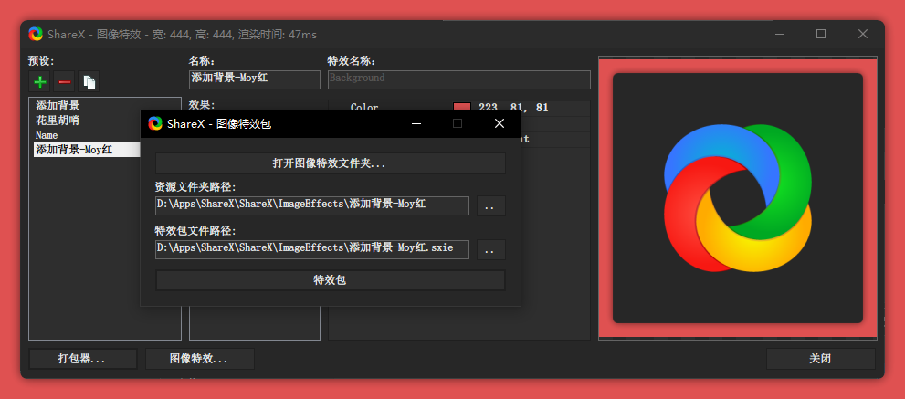  
如果是绿色版，可以通过 **把 sxie 文件拖入这个窗口** 来安装其他的特效。  
  
官方推出了图像效果预设库：[Image effects - ShareX](https://getsharex.com/image-effects)  
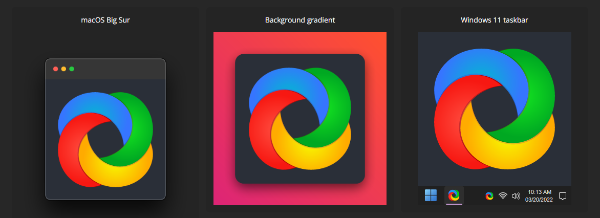  
  
### 搞笑特效  
有一个特效是在截图上加一根假的头发：  
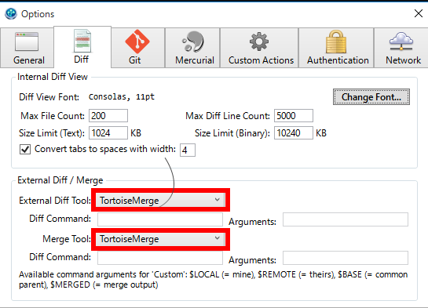  
  
好好笑，草。别说，做的还挺像真的！  
  
### 多区域模式  
Tips：在截图选项里开启 **多区域模式** 之后：  
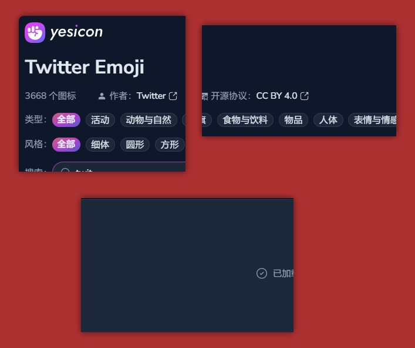  
就不会一键直接截图，而是可以反复调整具体尺寸了（和 Snipaste 保持一致）；  
而且可以把截取的多个图像直接拼贴在一起。  
  
可惜不能对每张都加圆角矩形，嗐。  
  
  
## 图片体积  
#### 压缩成其他格式  
有两个外部方案：  
[使用ShareX和Markdown Image自动压缩截图为WebP格式并一键插入Markdown文档 - 柯罗krau的博客 | krau's blog](https://krau.top/posts/use-sharex-and-mdimage-for-efficiency) 这个添加了一个 ShareX 动作去快速转换 webp 格式并复制。  
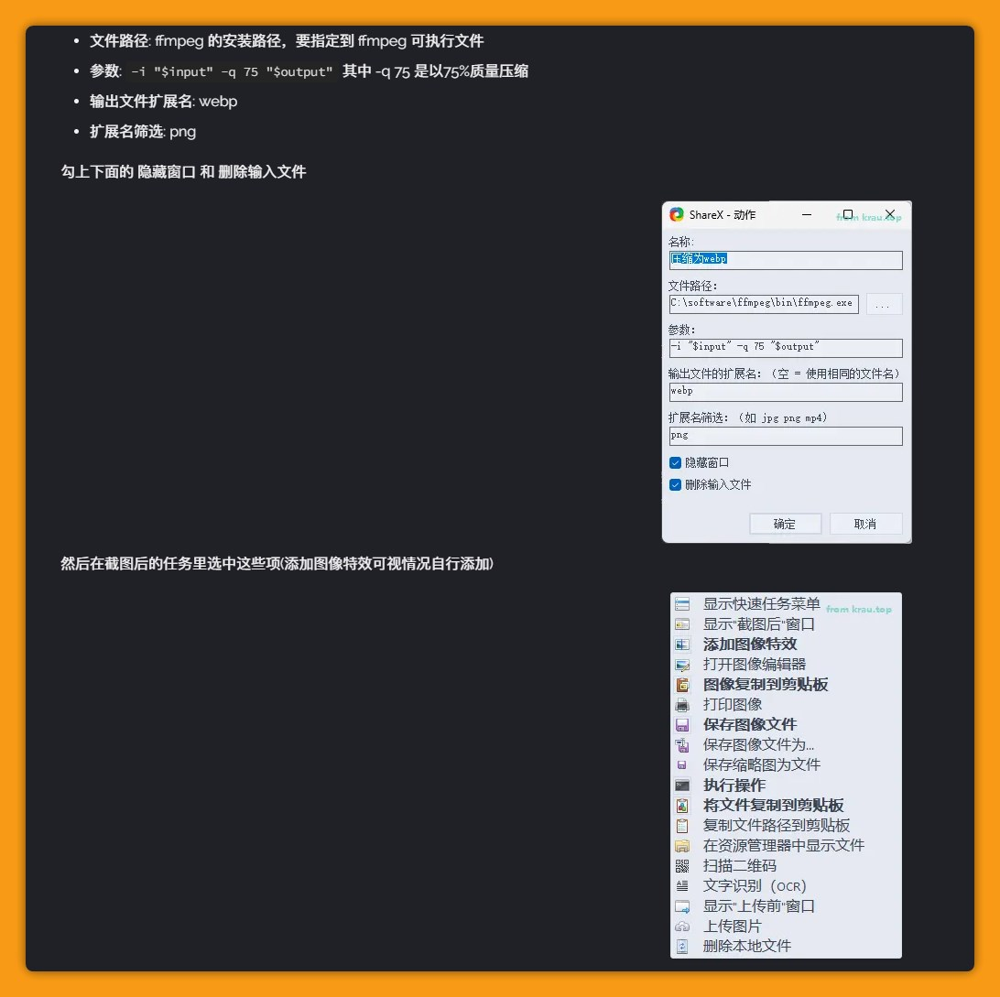  
  
  
[Sharex 截图压缩并转换成 webp格式 | 悠哉哉](https://www.uzz5.com/post/j9hs.html) 这个依赖了 ImageMagick 去二次压缩。  
  
#### png 和 jpg 的对比  
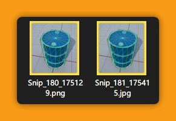  
  
png 格式：526 KB  
jpg 格式：80 KB  
体积相差了 6.5 倍……唔，还是用 jpg + 纯色背景吧！  
  
*顺便，用 Snipaste 截图了同样大小的图片，575 KB，差不多呢……*  
  
可以在这里设置截图的格式：  
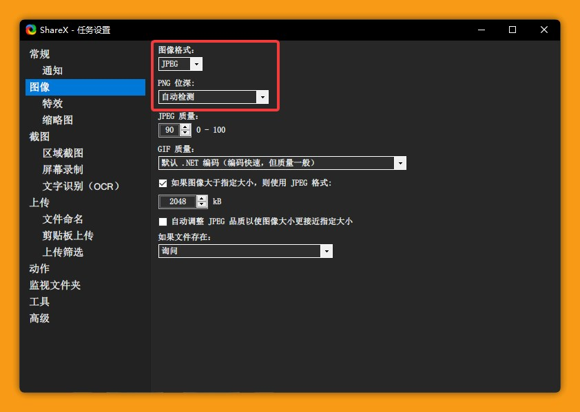  
  
  
### Webp 呢？  
支持吗——  
  
  
噢，是支持的！  
那其实尝试用 Webp 也说不定可以。  
  
从这张 Logo 来看，体积大概是 png 的 1/3。  
（那其实还是 jpg 更小噢）  
  
  
## 文件命名  
在这里设置：  
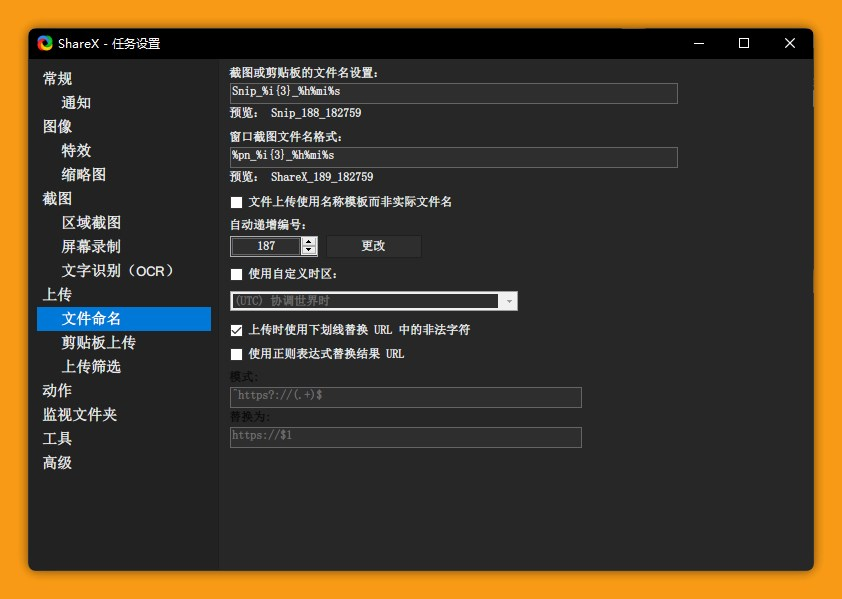  
  
在使用 ShareX **作为文件粘贴** 的时候，会保留文件名，这个时候命名是有效的。  
  
否则，会按照图片来自动重命名。  
  
如果想设置重命名格式的话，可以参考 <span title="某个私人页面">████</span> 部分。  
  
  
