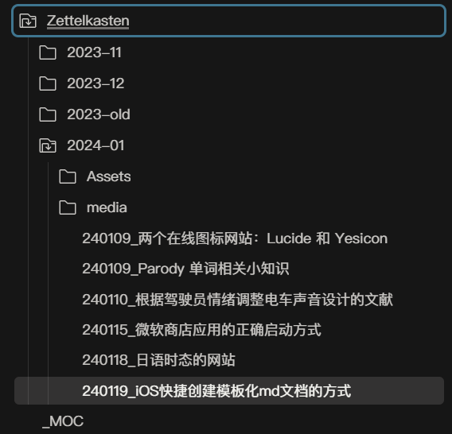

---  
title: 如何在 iOS 上快速创建带有模板的md文档  
description: 使用快捷指令，快速在指定的文件夹内创建 markdown 文档，并套用固定的模板和日期前缀。  
date: 2024-01-19T00:56:00  
lastmod: 2024-01-19T01:56:00  
tags:  
  - obsidian  
  - iOS  
aliases:   
categories:  
  - 分享  
  - 工具  
publish: true  
---  
  
# iOS快捷创建模板化md文档的方式  
  
## 前情  
如 <span title="某个私人页面">████</span> 所说，终于开始使用 Git 进行 Obsidian 的同步了！  
  
与此同时，使用 **Working Copy** 进行 Github 的仓库同步，然后用 **MWeb** 进行文档的编辑和查看。  
关于 App 的选择，详见：<span title="某个私人页面">████</span>  
  
为什么不用 Obsidian 原生 iOS 应用呢？  
——因为 Ob 的原生应用不支持访问外部文件夹，反而没法和 WorkingCopy 同步下来的文件进行交互。  
（而我不舍得订阅 Obsidian 官方 Sync 服务x）  
  
## 我的需求  
总之，既然千辛万苦解决了 iOS 端的同步问题，那当然是想在手机上能够方便地查看和添加文件的。  
  
查看目前没啥问题，用 MWeb 就能搞定。  
添加的话……  
虽说也可以用“新建文件”的方式，但是那样和我自己的**工作流**非常不同意。  
  
举个例子，我的**Zettelkasten**卡片盒文件夹，专门用来收集一些零散的信息。  
  
它需要创建在 `Obsinote/Zettelkasten/年份-月份/日期前缀_笔记名称.md` 的路径下。  
举个例子，今天是2024年1月9日，我想要添加一个叫做“iOS快捷创建模板化md文档的方式”的笔记，那它应该存在这个路径下：  
`Obsinote/Zettelkasten/2024-01/240109_iOS快捷创建模板化md文档的方式.md`  
  
整体结构如图：  
  
  
与此同时，文件内应该自动添加这样的 frontmatter 属性：  
```yaml  
---  
title: {笔记标题}  
description:   
date: {创建日期}  
lastmod:   
tags:  
aliases:   
---  
```  
  
这一系列模板化的、和当前日期绑定的文本内容，靠自己手填显然是不现实的……  
  
所以我们需要——自动化！  
  
  
## 快捷指令，登场  
在现如今的 iOS 上玩自动化，第一时间想到的当然是官方的 **快捷指令（Shortcuts）**。  
*正如在 PC 端第一时间想到是 Quicker！*  
  
### 保存文本文件  
首先尝试了一下“创建文件”，是可以的。  
  
具体方法就是：  
* 添加一个「文本」节点  
* 用「保存文件」节点，将文本内容储存到指定位置  
  
看上去一切顺利，不过有一个问题：  
不管我怎么指定文件的后缀名，它都会存成 `.txt` 文件，而不是我希望的 `.md` 文件。  
  
经过一番调查，发现应该用「更改名称」节点，变成这样的流程：  
* 添加「文本」节点  
* 用「更改名称」节点将文本的名称修改成「xxx.md」  
* 用「保存文件」去储存「更改名称后的项目」  
  
**只有用这种方法才能存下 *非txt格式* 的文本文件！**  
  
### 格式化内容  
  
第一部分：日期  
这个倒是比较容易，变量填空里自带一个 **当前日期** 的变量。  
添加之后点击一下，格式修改为 **自定义**，然后按照自己希望的日期格式填写就好了。  
  
比如我的文件夹路径是：`Zettelkasten/yyyy-MM`  
文件名前缀则是：`yyMMdd_`  
  
  
第二部分 frontmatter 元数据也很简单，直接填写在「文本」节点内部就好。  
*记得在 `属性:` 后面需要有一个空格！*  
  
### 用户输入  
最后，添加两个用户输入，分别获得笔记的名称和内容，拼合在一起就大功告成啦！  
  
文件储存完后还可以加一个 WorkingCopy 的节点，直接在软件内显示这个新创建的笔记，方便快速编辑。  
（可惜 MWeb 好像不支持快捷指令……）  
  
  
最后的结果如下：  
第一部分：获取用户输入，并填写基本的模板  
  
  
第二部分：保存到指定位置并打开  
  
  
你也可以直接下载我分享的快捷指令：  
  
  
——以上！  
