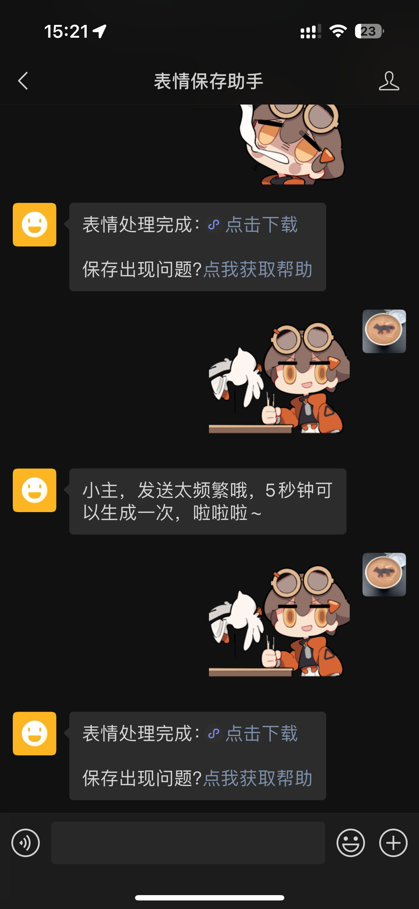
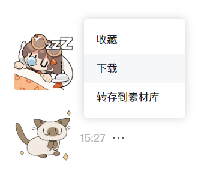
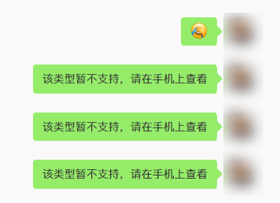
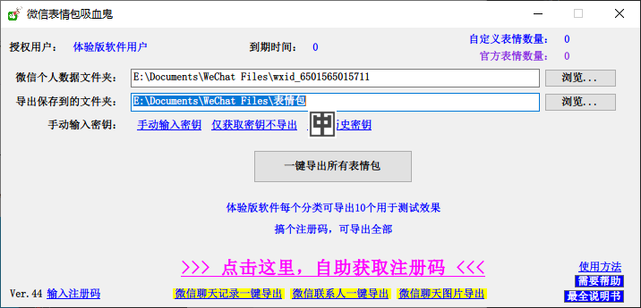
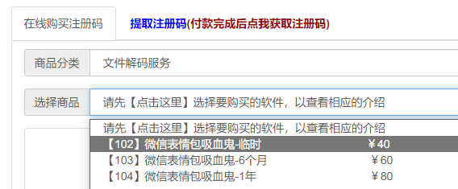
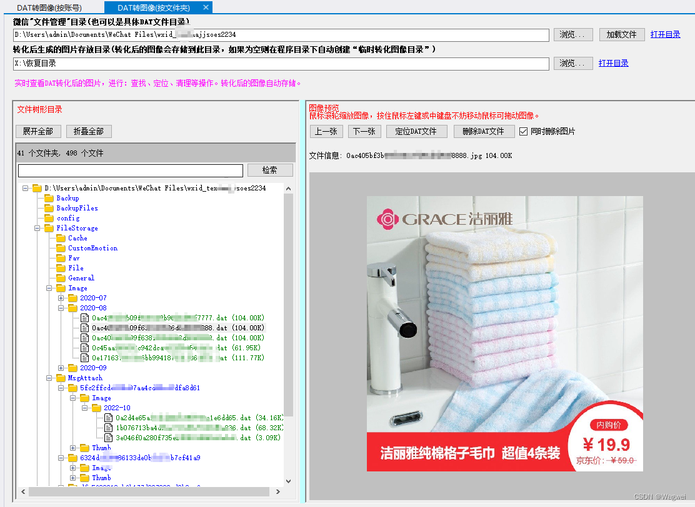
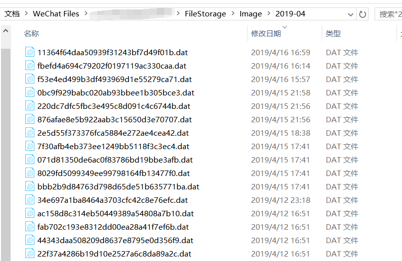
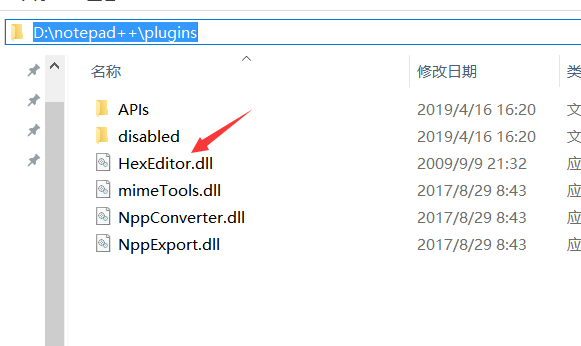
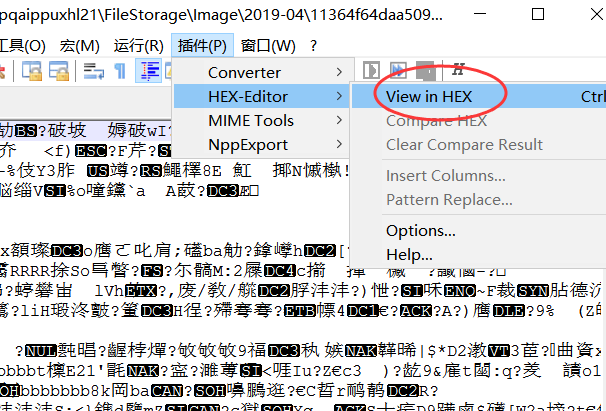
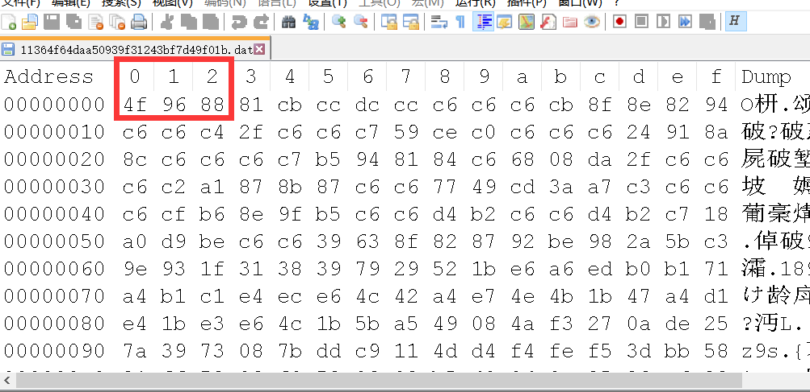

---  
title: 2024 年如何保存微信表情包  
description: 很多网上的方法现在都已经失效了，自己重新探索了一遍，整理了当前还有效的方法（顺便探索了一下PC端的加密表情文件，但没有结果🤷‍♀️）  
date: 2024-01-19T12:24:00  
lastmod: 2024-02-27T10:37:00  
tags:  
  - output/blog  
  - 表情包  
aliases:   
publish: true  
image: Assets/240119_微信表情包保存与破解探索-img-1.png  
categories:  
  - 分享  
  - 软件  
---  
  
# 微信表情包保存与破解探索  
很多网上的方法现在都已经失效了，自己重新探索了一遍，整理了当前还有效的方法。  
顺便探索了一下PC端的加密表情文件，但没有结果哈哈。  
  
## 保存表情包  
### 最简单的方法：微信公众号  
如果只想简单直接地保存某个特定表情包，可以搜索「表情保存助手」公众号：  
  
  
关注公众号后，直接发送表情，等一会儿就会收到一个表情包下载的链接。  
试了一下存下来的 gif 质量挺不错的，也有透明底，也会动：  
  
> 这个表情包是《新月同行》的超级秋千人，特别逗的两套，可惜目前只有微信上架了……我就是为了保存她的几张表情才折腾这篇文章的！  
  
**缺点就是这个公众号时不时要看广告。**  
  
  
### 其他提取方法呢  
另外还尝试了比较热门的几种方案。  
  
#### 一、发给自己的微信公众号  
为了存表情专门开个公众号有点太劳民伤财了……但……  
  
  
——**还真可行**。  
  
我估计上面的那个表情助手公众号也是相同原理，只是后台做了个自动化流程帮你把图片转存下来，然后给个临时的下来链接。  
  
  
#### 二、文件传输助手 / 网页版微信  
都不行，会显示「该类型不支持」：  
  
  
#### 三、使用小工具  
如果真的有大批量的表情想要转换，那就需要在电脑上进行操作了。  
  
这里有一篇指导文章：  
[怎么把微信表情包存到电脑上？亲测有效！_微信表情导出到电脑 2023-CSDN博客](https://blog.csdn.net/m0_69862284/article/details/131118173)  
  
大概就是用了网友「天才小网关」（神奇的ID！）开发的一个叫做「微信表情包吸血鬼」（更神奇的软件名！）工具，来把电脑上储存的加密文件给转换出来。  
  
我试了一下，是有用的。  
有需要的话也可以直接在这里下载工具：  
[【微信表情包吸血鬼】软件，一键导出所有微信表情包，有趣的表情包，不再只限一个APP使用-软件资源-天才小网管](https://www.qinyuanyang.com/post/338.html)  
  
但是吧，这个软件也是付费的：  
  
  
有免费模式，可以每个分类导出10个表情作为预览。  
一套表情包可能会有10几个表情，如果只是想抓几个好用的话一般也够了。  
  
自定义表情也能导出，但是只有10个，这样就不太够哈哈。  
  
导出的效果也没问题的：  
  
  
如果要求高的话可以花￥40买个注册码。  
  
  
  
> 顺便，这个开发者好像专攻微信相关的数据提取……看了一下有好多相关工具。  
  
> 我自己提取出来的在这里：  
> [微信提取表情包](file:\\E:\Documents\WeChat%20Files\表情包) （本地路径）  
  
  
#### 提取微信图片（而非表情包）  
虽然都是微信的媒体文件，但图片和表情好像是两套内容。  
  
如果想提取图片，这里也顺便找到了一个工具：WxLib  
来自：  
[微信DAT文件解密（dat转图像）_微信图片dat解密工具-CSDN博客](https://blog.csdn.net/weixin_42324309/article/details/127802746)  
  
  
  
> 2022年06月，微信电脑版发布更新后，新产生的微信聊天图片不会再保存到：微信文件管理目录\微信号\FileStorage\Image\年月  
>   
> 而是改成了存储到：微信文件管理目录\微信号\FileStorage\MsgAttach\聊天对象标识\Image\年月  
  
  
## 破解表情包  
  
后面一大堆资料，零零总总的……  
  
但大概意思是：<mark>现在微信存的 `.dat` 文件都是加密过的。</mark>  
  
图片还好一点，用的是异或，只需要把二进制文件批量处理一遍就行。  
表情包好像加上 RSA 了，这玩意儿不搞软件逆向谁搞得定啊……！  
  
从天才小网管那个软件也可以倒推，是需要本机登录的微信账号的 key 的。  
**这个没必要深究下去了，到此为止吧。**  
  
总之，不好弄。  
有需求就用上面法子吧，别自己折腾了。  
  
  
  
  
  
### 博客园的帖子  
最开始找到的是这个参考资料：  
[搞搞电脑微信表情的破解（.dat转png or jpg） - Esquecer - 博客园](https://www.cnblogs.com/Esquecer/p/10718444.html)  
  
#### 摘要  
  
然后找到了我微信源文件的Image文件。发现源文件都是清一色.dat格式文件。  
  
这时候第一步直接把后缀改了jpg :（ 很失望，不行，无法打开文件。  
  
然后去谷歌搜了一下，大牛们都说是 <mark>微信用异或操作加密了Jpg</mark>.  
于是朝这个方向入手。  
  
首先下载notepad++,再给它配上Hex-Editor插件，这样我们就能用notepad++用16进制打开dat了  
  
我的办法是：  
  
第一步：就是从网上（[https://sourceforge.net/projects/npp-plugins/files/Hex%20Editor/](https://sourceforge.net/projects/npp-plugins/files/Hex%20Editor/)）下载Hex-Editor.dll文件。    
第二步：然后拷贝到你自己notepad安装目录的plugins子文件夹下。    
第三步：最后重启notepad。  
  
  
  
  
  
然后在这里打开16进制显示，就好了。  
  
这样我们就得到了16进制源文件。  
我以下图为样例分析。  
  
  
  
这是打开的DAT文件，前三位是4F 96 88。按照网上大牛说了 做过了异或操作 再存储的。那么我们来试着还原。  
  
给出参考文件头：  
- JPEG (jpg)，文件头：FFD8FF  
- PNG (png)，文件头：89504E47  
- GIF (gif)，文件头：47494638  
  
好办了，直接逐个测试下。  
  
我发现我这个dat 是 4F^C6 = 89,96^C6 = 50,88^C6=4E  
对应得上PNG格式的文件。  
  
然后就是java打开文件重新异或之后输入输出啦。  
  
JAVA代码(对单个文件操作，折叠的是对整个文件夹操作)  
  
这里有个彩蛋是：本来想用python操作文件的（方便），但是本人配置了近5小时sublime+python3，因为各种墙（GFW牛逼）的问题和各种插件需要慢慢安装体验感很差，遂投入java怀抱（真香）  
  
  
---  
  
  
### 吾爱破解上的帖子  
[微信表情包导出工具 实测别人发的也会导出 - 『原创发布区』 - 吾爱破解 - LCG - LSG |安卓破解|病毒分析|www.52pojie.cn](https://www.52pojie.cn/thread-1786582-1-1.html)  
  
这个是最新的，2023年5月份，看起来挺靠谱。  
但是没有 52 的账号……玩不了。  
  
  
  
### 其他  
  
#### Python 一号  
  
[PC版微信加密图片解密思路与代码实现_Python_微信电脑版图片另存代码-CSDN博客](https://blog.csdn.net/theLeMon/article/details/105471160?utm_medium=distribute.pc_relevant.none-task-blog-2~default~baidujs_baidulandingword~default-0-105471160-blog-132631988.235^v40^pc_relevant_anti_t3&spm=1001.2101.3001.4242.1&utm_relevant_index=1)  
用 Python 实现了一版，20年的，可能有点老。  
  
  
摘要：  
  
存储的文件均为DAT格式。不能直接打开。当用户删掉聊天记录后，又想找回丢失的图片文件会造成一定的困扰。如果能找到其加密方式就能对这类文件解密还原成jpg/png/gif等常见的文件格式。  
  
#### 解密思路  
- 这类对文件加密的方式很容易让人联想到“异或法加密”，即对文件逐个字节与加密码进行异或计算得到加密文件。  
- 使用16进制的方式打开DAT文件，可见几乎前两个字节均为 0xDF，0xF8。    
      
- 而jpg头信息前两个字节为0xFF, 0xD8。用0xDF与0xFF做异或运算，0xF8与0xD8做异或运算。<mark>结果均为0x20。因此可得加密码为0x20</mark>（但在实际操作中，每个用户的加密码都不一样，需要在程序中计算出的加密码）。  
  
  
#### 代码  
```python  
import os  
# 图片字节头信息，  
[0][1]为jpg头信息，  
[2][3]为png头信息，  
[4][5]为gif头信息  
pic_head = [0xff, 0xd8, 0x89, 0x50, 0x47, 0x49]  
# 解密码  
decode_code = 0  
  
def get_code(file_path):  
    """  
    自动判断文件类型，并获取dat文件解密码  
    :param file_path: dat文件路径  
    :return: 如果文件为jpg/png/gif格式，则返回解密码，否则返回0  
    """  
    dat_file = open(file_path, "rb")  
    dat_read = dat_file.read(2)  
    head_index = 0  
    while head_index < len(pic_head):  
    # 使用第一个头信息字节来计算加密码  
    # 第二个字节来验证解密码是否正确  
        code = dat_read[0] ^ pic_head[head_index]  
        idf_code = dat_read[1] ^ code  
        head_index = head_index + 1  
        if idf_code == pic_head[head_index]:  
            dat_file.close()  
            return code  
        head_index = head_index + 1  
  
    print("not jpg, png, gif")  
    return 0  
  
  
def decode_dat(file_path):  
    """  
    解密文件，并生成图片  
    :param file_path: dat文件路径  
    :return: 无  
    """  
    decode_code = get_code(file_path)  
    dat_file = open(file_path, "rb")  
    pic_name = file_path + ".jpg"  
    pic_write = open(pic_name, "wb")  
    for dat_data in dat_file:  
        for dat_byte in dat_data:  
            pic_data = dat_byte ^ decode_code  
            pic_write.write(bytes([pic_data]))  
    print(pic_name + "完成")  
    dat_file.close()  
    pic_write.close()  
  
  
def find_datfile(dir_path):  
    """  
    获取dat文件目录下所有的文件  
    :param dir_path: dat文件目录  
    :return: 无  
    """  
    files_list = os.listdir(dir_path)  
    for file_name in files_list:  
        file_path = dir_path + "\\" + file_name  
        decode_dat(file_path)  
  
  
path = input("请输入需要解密微信dat文件的目录:")  
find_datfile(path)  
```  
  
#### Python 二号  
  
[python微信数据解密-dat文件转图片(支持JPG,PNG,GIF)_微信dat转图片-CSDN博客](https://blog.csdn.net/qq_37673902/article/details/115128577)  
  
没怎么写思路，直接上的代码。  
  
  
  
#### 代码  
```python  
# weixin_Image.dat 破解  
# JPG 16进制 FF D8 FF  
# PNG 16进制 89 50 4e 47  
# GIF 16进制 47 49 46 38  
# 微信.bat 16进制 a1 86----->jpg  ab 8c----jpg     dd 04 --->png  
# 自动计算异或 值  
import os  
  
into_path = r'C:/image'  # 微信image文件路径  
out_path = r"C:/image/jpg"  
  
def main(into_path, out_path):  
  
    dat_list = Dat_files(into_path)  # 把路径文件夹下的dat文件以列表呈现  
    lens = len(dat_list)  
    if lens == 0:  
        print('没有dat文件')  
        exit()  
  
    num = 0  
    for dat_file in dat_list:  # 逐步读取文件  
        num += 1  
        temp_path = into_path + '/' + dat_file  # 拼接路径：微信图片路径+图片名  
        dat_file_name = dat_file[:-4]  # 截取字符串 去掉.dat  
        imageDecode(temp_path, dat_file_name, out_path)  # 转码函数  
        value = int((num / lens) * 100)             # 显示进度  
        print('正在处理--->{}%'.format(value))  
  
  
def Dat_files(file_dir):  
    """  
    :param file_dir: 寻找文件夹下的dat文件  
    :return: 返回文件夹下dat文件的列表  
    """  
    dat = []  
    for files in os.listdir(file_dir):  
        if os.path.splitext(files)[1] == '.dat':  
            dat.append(files)  
    return dat  
  
def imageDecode(temp_path, dat_file_name, out_path):  
    dat_read = open(temp_path, "rb")  # 读取.bat 文件  
    xo, j = Format(temp_path)  # 判断图片格式 并计算返回异或值 函数  
  
    if j == 1:  
        mat = '.png'  
    elif j == 2:  
        mat = '.gif'  
    else:  
        mat = '.jpg'  
  
    out = out_path + '/' + dat_file_name + mat  # 图片输出路径  
    png_write = open(out, "wb")  # 图片写入  
    dat_read.seek(0)  # 重置文件指针位置  
  
    for now in dat_read:  # 循环字节  
        for nowByte in now:  
            newByte = nowByte ^ xo  # 转码计算  
            png_write.write(bytes([newByte]))  # 转码后重新写入  
  
    dat_read.close()  
    png_write.close()  
  
  
def Format(f):  
    """  
    计算异或值  
    各图片头部信息  
    png：89 50 4e 47  
    gif： 47 49 46 38  
    jpeg：ff d8 ff  
    """  
    dat_r = open(f, "rb")  
  
    try:  
        a = [(0x89, 0x50, 0x4e), (0x47, 0x49, 0x46), (0xff, 0xd8, 0xff)]  
        for now in dat_r:  
            j = 0  
            for xor in a:  
                j = j + 1  # 记录是第几个格式 1：png 2：gif 3：jpeg  
                i = 0  
                res = []  
                now2 = now[:3]      # 取前三组判断  
                for nowByte in now2:  
                    res.append(nowByte ^ xor[i])  
                    i += 1  
                if res[0] <mark> res[1] </mark> res[2]:  
                    return res[0], j  
    except:  
        pass  
    finally:  
        dat_r.close()  
  
  
# 运行  
if __name__ == '__main__':  
    main(into_path, out_path)  
  
```  
  
  
### csdn 的网友逆向过程  
[PC微信逆向获取聊天表情_微信 customemotion文件解密-CSDN博客](https://blog.csdn.net/ljc545w/article/details/123259966?ops_request_misc=%257B%2522request%255Fid%2522%253A%2522170564637016800225569637%2522%252C%2522scm%2522%253A%252220140713.130102334..%2522%257D&request_id=170564637016800225569637&biz_id=0&utm_medium=distribute.pc_search_result.none-task-blog-2~all~baidu_landing_v2~default-1-123259966-null-null.142^v99^pc_search_result_base1&utm_term=%E5%BE%AE%E4%BF%A1%20%E8%A1%A8%E6%83%85%20%E8%A7%A3%E5%AF%86)  
  
这个更是只有个思路的开头，但是时间比较新，22年的。  
  
重点就是在 `CustomEmotion` 文件夹内，所有的文件开头会是 `5631XXXX`，  
然后这个转译过来——和图片不同——是 `V1MMVX` ，算是特别的内容。  
除了这6个字节，后面 1024 个字节使用 RSA 加密，剩下的部分用异或加密。  
  
这里还有更多微信逆向的文章：  
[勇敢自由-CSDN博客](https://blog.csdn.net/ljc545w?type=blog)  
  
噢，还有个机器人！  
[ljc545w/ComWeChatRobot: PC微信机器人，实现获取通讯录，发送文本、图片、文件等消息，封装COM接口供Python、C#调用](https://github.com/ljc545w/ComWeChatRobot)  
  
不过只有针对的微信版本可用。  
